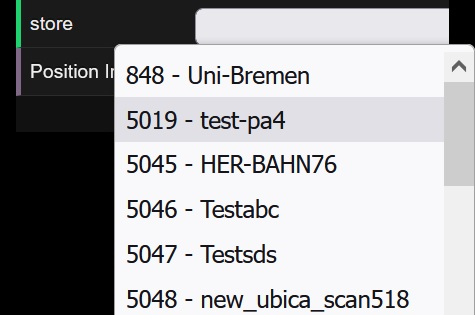
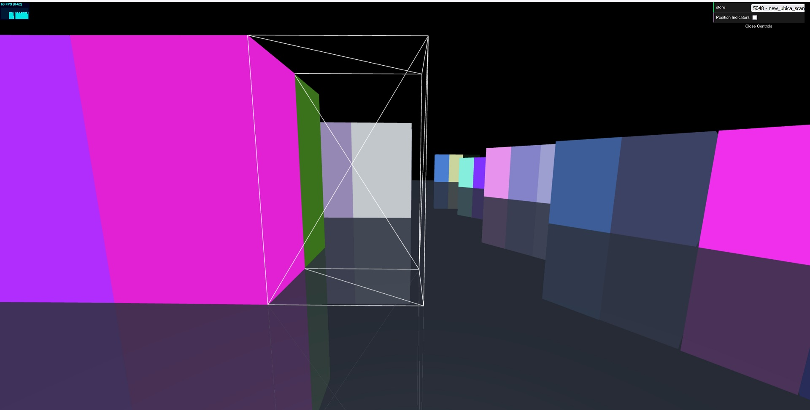

# K4R Store Visualization
## Overview
The storeviz application provides a browser-based 3D representation of your digital twins. It fetches the list of stores from the dt-api and presents a walkable model of the selected store. The representation is useful to acquire a quick overview and sanity check when using sensors to scan the actual layout of your store.

## Usage
Open storeviz from the portal application. If no store was preselected via deeplinking, select a store from the dropdown:

Use mouse or fingers to pan and zoom. Middle mouse button selects a shelf and displays detail information about the entity.

## Development
The codebase is pure typescript using Threejs as the rendering engine. Packaging is handled with webpack. Expressjs is used to serve the application from within the container. To access dt-api, authentication via oauth2-proxy is required in order to ensure that authentication information is included in the backend calls.
The code itself is based on a simple entity-component-system. More detailed representation of shelf-content can be created by adding customized rendering components written to your liking.
